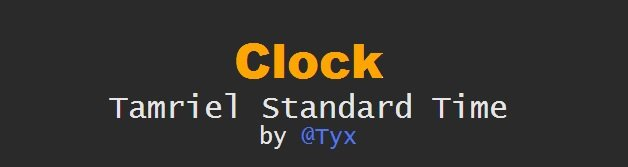

**Thank you all for more than 250.000 Downloads.**

I would like to thank all the people who gave me donations. It means a lot to me.
I guess you want to stay anonymous but if you like to be named, please write me a PM.

## **Dependencies**
* [LibAddonMenu-2.0]("https://www.esoui.com/downloads/info7-LibAddonMenu.html")
* [LibMediaProvider]("https://www.esoui.com/downloads/info56-LibMediaProvider.html")

## **Latest Update**
I completely rewrote the Clock - Tamriel Standard Time 
It has now a much better performance, a pretty code background and many more features. 
[Check it out!]("https://www.esoui.com/downloads/info2536-Clock-TamrielStandardTime2.0.html")
This legacy version should still work for a long time, but will not receive any updates anymore.

## **Overview**

This addon *Clock - TST* adds a completely customizable and movable label to the game which shows you the current date and time of *Tamriel* and of Earth (linked to your system time, thus it is accurate where ever you are).
Additionally, it also shows the current state of the moon and the remaining time to the next phase.

## **Updates**

The last update 1.0.0 brings you a fixed Fake Lore Date and an improved  fragment handeling (no more warnings when opening the menu). The FLD  will show you the current week day, day and month month in the real  world with a lore name.

Update 0.7.8 added independently sizeable moon and phase labels with a  customizable look of moon label independent of the clock label. It has a  improved moon alignment inspired by Kenza. it also is now fully  translated into French (all thanks to Fifish).

With update 0.7.6 comes a Japanese translation thanks to @BowmoreLover from the ESOUI community.
Together with the new localisation, Clock can now set to show 0 am instead of 12 am at midnight with the 12h setting.

Since 0.7.2 also with Russian localisation! (next to English and German).

With Update 7 a new background feature was added. The *Clock - TST* never looked that good before. Check it out.
Additional to that and a few bug fixes, you can now have your real time next to the Tamriel time instead of beneath.

You can use this addon together with [Harven's Dwemer Clock]("https://www.esoui.com/downloads/info642-HarvensDwemerClock.html")  to get the in-game Time as a fantastic looking, animated clock. Install  both addons then right-click on the Dwemer Clock and click "Use Tamriel  Standard Time Clock" option. You can change the size of the Dwemer  Clock by clicking on it (left mouse button) and then scrolling with your  mouse wheel over the Clock.

Check out kerb9729's Addon for *Clock - TST*: [Midnight]("https://www.esoui.com/downloads/info1167-Midnight.html"). It will show you the time until midnight.

Follow the Clock on [GitHub]("https://bit.ly/clockTSTGitSource") to always get the latest beta/alpha Version (caution: unstable)
I will release every stable build here as soon as possible!
If you like an offline desktop application of the Clock to see the  current time in Tamriel where ever a PC is, search no further and look [here]("https://bit.ly/clockGitJApp") (still an alpha Version)

## **Features**

This AddOn will show you the current time in *Tamriel*.
It is displayed on the Interface wherever you want it to be - **completely movable**.
You are also able to **set the size, font and style of the clock** to your liking.

The time in Tamriel is not a fact.

There is not function in the API which gets us the length back.
Many people right now are trying to figure out how long a day is.
Zenimax Online stated in their FAQ that the time is a bit less than 5h, but after many tests, I am sure it is 5,83h long.
If you agree with me or not is up to you.
You are able to **customize the length of the day** easily in the *Clock - TST* settings.
This can be done to a precision of seconds.

The time could be off after a maintenance or something else.
With the settings menu or commands you can **choose one out of four times to synchronize the clock**.
For example, you see the sun right under your South needle of the compass. 
You are sure that it is noon right now. 
No problem: Just write /cl noon in the chat or use the "Noon is now!" button in the settings to sync your clock.

The best way to sync your Clock is to set the clock to noon at noon and wait a day or more (in-game).
Then set your time (at noon again) so that your clock shows exactly 12:00.
When this is done you should have a perfectly synced clock
Noon is best because you can see the sun and you have a compass 
So just wait until the sun is right under you South sign at your compass.
 
Right now, the settings and the **Clock is localized in English, German and Russian**.

If you are from the US or any other country which uses a 12-hour clock,  you are able to change the clock to that format too. You can even hide  the am/pm signs.
Of course you can **use the formats: 12h or 24h** wherever you are from.
You can also **hide the 0 before a single number**: 01:12 -> 1:12.

I personally love to see the seconds pass by. It is fun to see if they  reach the zero or step over it (because of the game to real time ratio).  It is like the screensaver of a DVD player... you have to watch for  some reason.
If they distract you too much - like me - or you just don't want to see them, just disable them.
You can **disable to show seconds** in the settings menu.

You can let the Clock AddOn **show you the current moon phase and the time to the next one**.
This feature is like the time not based on a fact but on an adjustable algorithm.
After many months of studying it, I am sure the one cycle is 30 Tamriel  days long, but you can still change the length of the different phases.
You can **customize the length of a moon phase** at the settings menu.

Clock does not stop there. 
You can also let the Clock show you the **current lore date on your screen** either as a real calculated date or a fake one representing the current real date as a lore date.

The look of the **time and date are fully customizable**. 
Write a String like this in the text field in the settings:
*_DDD, _D day of _MMM _YY _hh:_mm:_ss*

It will return you a date looking like this:
*Fredas, 4th day of First Seed 2E 582 07:09:08*

If you want the Clock will also **show you the current real date and time** as customizable as the lore time and date.

### **TL;DR**
**Clock - TST gives you a fully customizable lore- (and real-) date and time system with moon cycle integration.**

**If you want a new feature to be added too, feel free to suggest it [here]("https://www.esoui.com/portal.php?uid=4069&a=listfeatures").**

## **Commands**
 
You can easily change all settings in the menu:
The panel can be called with writing the command /clsettings in the chat.
Or To open it press "esc" -> choose "settings" and look for "Clock - Tamriel Standard Time".

If it is too much of a hassle for you, there are also chat commands.
The meta command is **/cl**
/cl active toggle the clock on or off
/cl date toggle the date on or off
/cl ldate toggle the lore date on or off
/cl fldate toggle the fake lore date on or off
/cl help will give all available commands
/cl moon toggle the lines for the moon phase under your clock on or off
/cl rt toggle the Real Time on or off
/cl reset resets the clock to the default values (all saved values will be lost)
/cl resetUI resets the changes only to the clock look
/cl sec toggle to show seconds on or off
/cl show shows the length of a day and the upcoming times in real world time

Synchronize the Clock
/cl midnight will save the current time as midnight
/cl sunrise will save the current time as sunrise
/cl noon will save the current time as noon
/cl sunset will save the current time as sunset

/cl us Toggle am/pm format on or off

## **Known Bugs**

Clock will "jump" around if you activate or deactivate the date functions
 
**If you notice one please use this [link]("https://www.esoui.com/portal.php?uid=4069&a=listbugs") to report it.**
It will help me a lot.

## **Future Plans**
 
- 0.1 Add ingame time algorithm  
- 0.2 Display ingame time  
- 0.3 Create commands to adjust time
- 0.4 Create user interface to adjust clock
  - 0.41 Bugfixes
  - 0.42 Add hide seconds
  - 0.43 Rewrite time algorithm
  - 0.44 Make clock moveable and add colorize, fonts, styles, size to settings
  - 0.45 Bugfixes
- 0.5 Create moon cycle database
  - 0.51 Moon icon
  - 0.52 Various improvements
- 0.6 Various bug fixes and improvements
- 0.7 Added background
- 0.8 Display for moon cycle

Thanks to Harven I don't need to provide you with a custom animated Clock.
[He made already a really beautiful one compatible with this addon.]("https://www.esoui.com/downloads/info642-HarvensDwemerClock.html")

- 0.8 Make clock visible at the map
- 0.9 Animate clock
- 1.0 Add moon cycle to the clock (animated)

## **Thanks**
I am really thankful to the Community of ESOUI which helped me a lot in the forum and the comments or per PM.

Special thanks to **Seerah** for helping me out and giving us the LibAddonMenu, LibMediaProvider and LibStub which I use in this Addon.

Furthermore to name some helpful users which reported bugs and/or presented features:
**Munkry, Friiar, Sephiroth018, fosley, LegoManIAm94, WatersMoon110,  Kraeius, Phinix, logan9a, oldbushie, MAOofDC, QuadroTony, GT-Schorsch,  Philgo68, Phinix, KiriX, kerb9729, BowmoreLover, 
Fifish, Kenza** and of course **Garkin**.

I am sorry if I forgot to mention you if you helped me out too 

## **Zenimax Disclosure**

This Add-on is not created by, affiliated with or sponsored by ZeniMax Media Inc. or its affiliates.
The Elder Scrolls® and related logos are registered trademarks or  trademarks of ZeniMax Media Inc. in the United States and/or other  countries.
All rights reserved.