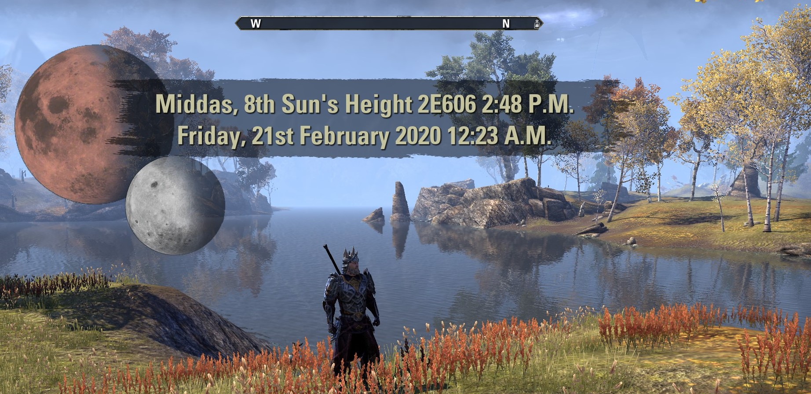
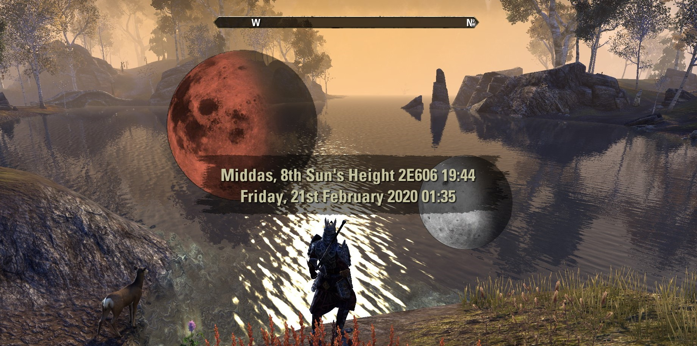
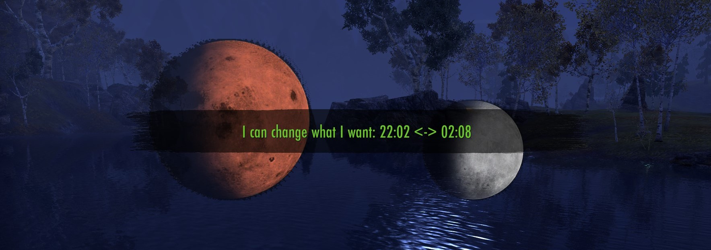
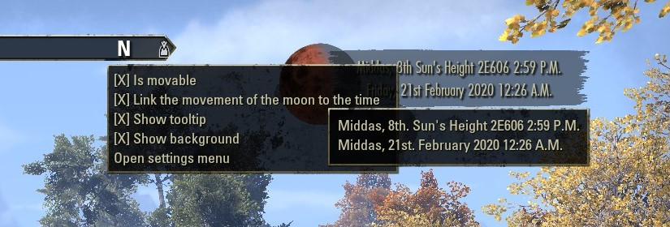
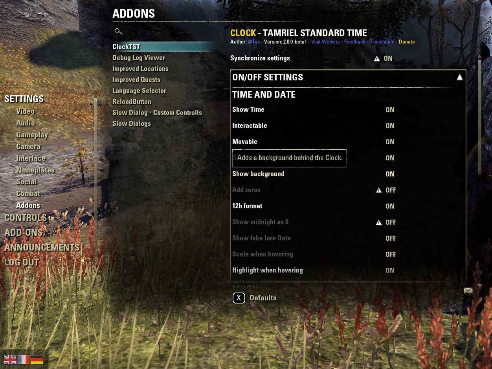
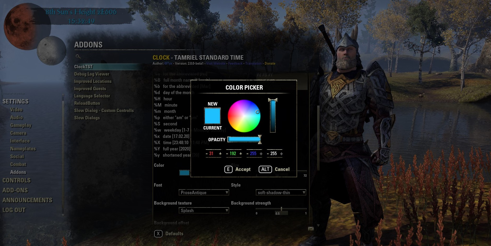
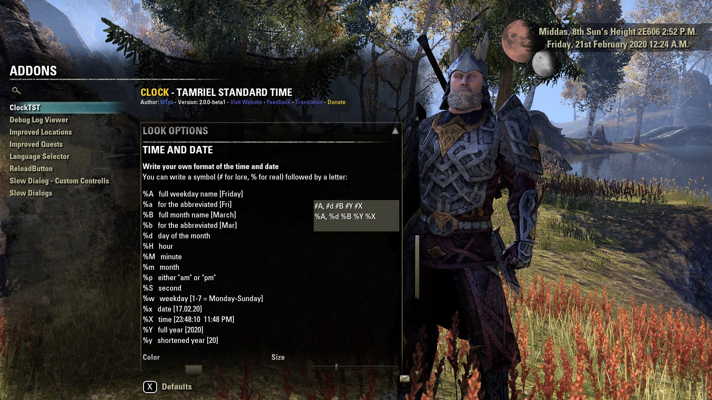
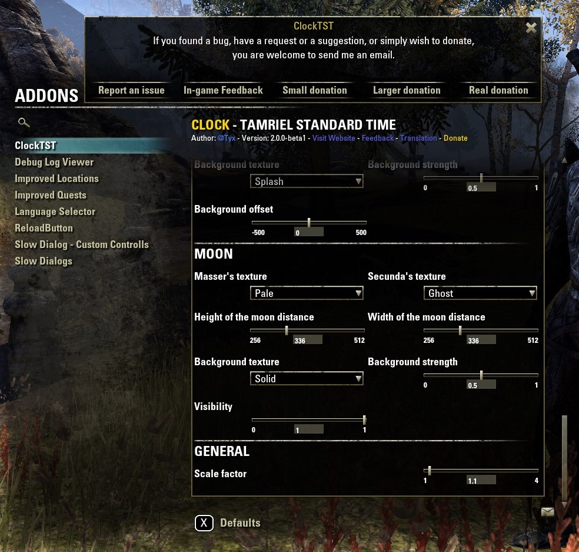
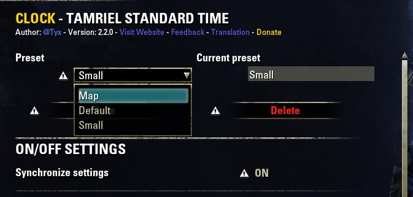
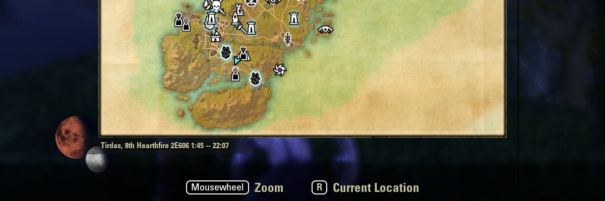

|                                                                                                                                             |        |                                                                                                                                                                                                                                                       |
| ------------------------------------------------------------------------------------------------------------------------------------------- | ------ | ----------------------------------------------------------------------------------------------------------------------------------------------------------------------------------------------------------------------------------------------------- |
| Version:                                                                                                                                    | 2.3.0  |                        |
| Build for game version:                                                                                                                     | 100030 |  |
|  |        |                                                |

# Version 2.3

## Custom Textures

## Various Styles

## Visual Helper

## Fully Customizable

## Manage Settings In Presets

# Copyright

    Copyright (C) 2020 Arne Rantzen

    This program is free software: you can redistribute it and/or modify
    it under the terms of the GNU General Public License as published by
    the Free Software Foundation, either version 3 of the License, or
    (at your option) any later version.

    This program is distributed in the hope that it will be useful,
    but WITHOUT ANY WARRANTY; without even the implied warranty of
    MERCHANTABILITY or FITNESS FOR A PARTICULAR PURPOSE.  See the
    GNU General Public License for more details.

    You should have received a copy of the GNU General Public License
    along with this program.  If not, see <https://www.gnu.org/licenses/gpl-3.0.html>